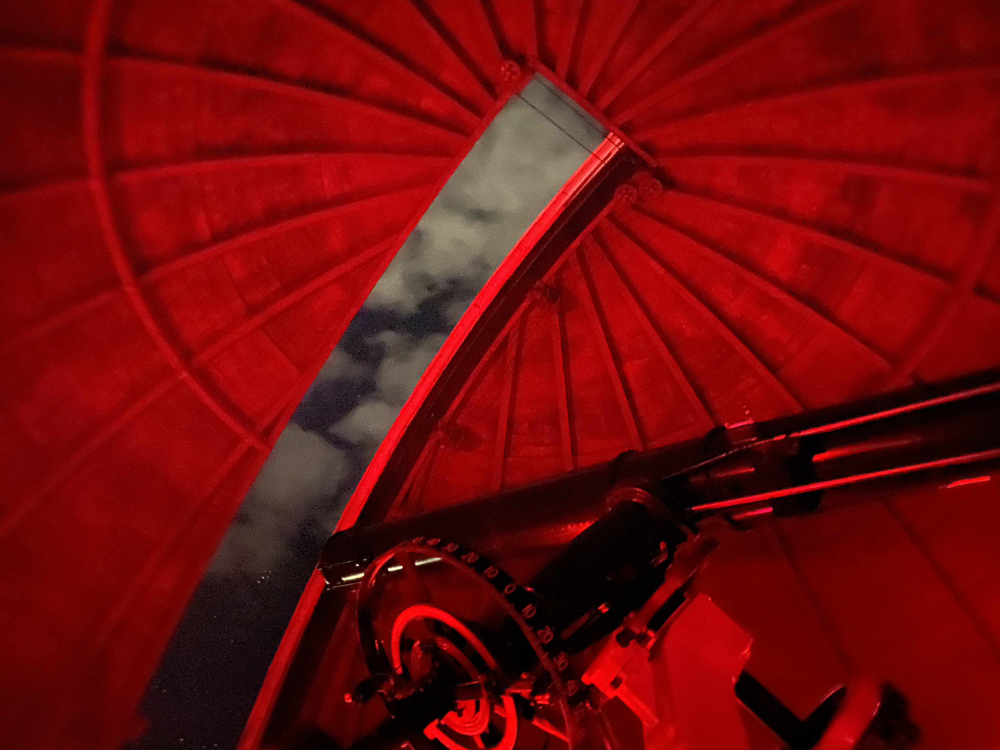
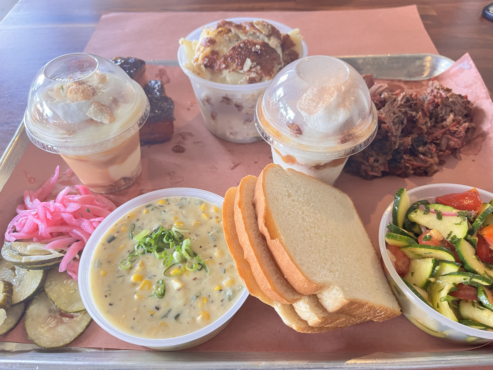
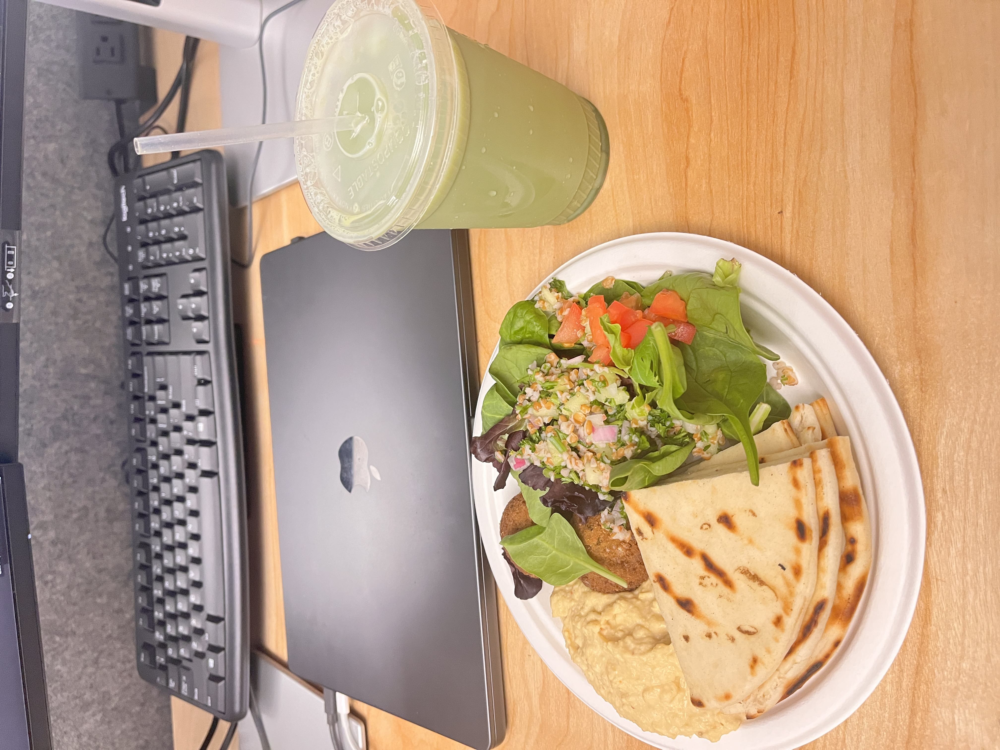
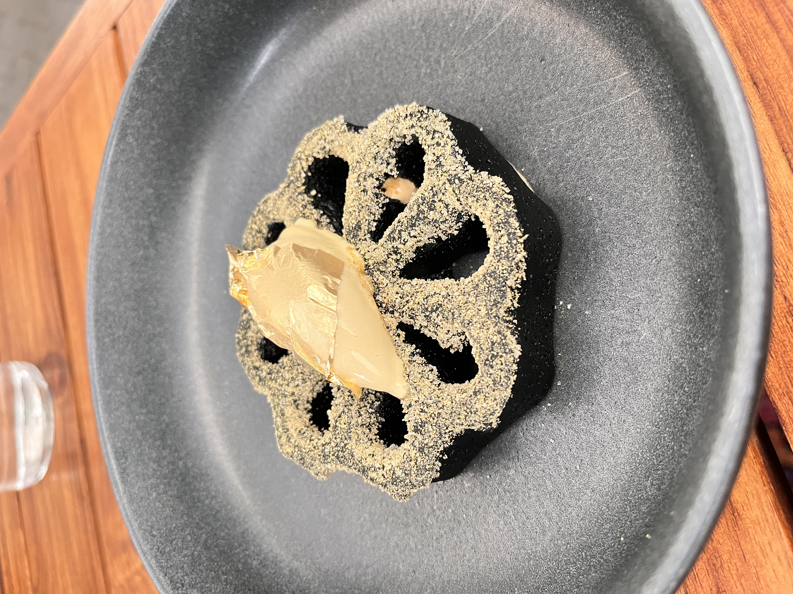
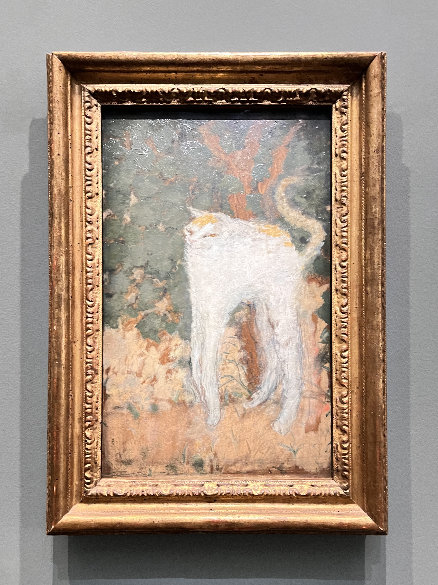

# Cathy Zhao

Welcome to my portfolio site.

---

## Resume

[Download my resume](./resume.pdf){: .resume-button }

---

## Internship Experience

I spent the Summer of 2025 working as a Software Development Engineer Intern at Amazon Web Services in Austin, TX. In this role, I worked on building and improving internal tools using TypeScript, React (including Redux and sagas), and AWS services. Over the 12-week internship, I deepened my skills in Git workflows, debugging, and working with large codebases, and I learned how to unblock myself by reading documentation and collaborating with other engineers.  

### Problem and solution

The Buyer Website at AWS Marketplace was undergoing a major shift toward pre-rendered pages served through a CDN. Because each widget team owned its own standalone pages, they had been building separate shell pages with inconsistent patterns and duplicated effort. My internship focused on creating a unified solution: a generic shell page platform that Marketplace and widget teams could use to launch new pages with less friction and far more consistency.

### My project

My project centered on designing and implementing two new production packages that would enable this platform. One provided reusable CDK constructs for deploying shell page infrastructure. The other generated full HTML documents by fetching chrome content from the appropriate CDN, applying the correct header and footer, and merging Content Security Policies safely. To validate the design, I implemented the entire Help page experience as the first tenant-side proof of concept and modernized its underlying JavaScript compilation.

Building this platform required deep end-to-end work across infrastructure, serverless systems, packaging, and frontend integration. I created a custom Lambda handler, routed requests through API Gateway, set up local development with Express, and unified the compilation story for teams adopting the new platform. This work replaced fragmented implementations with a coherent model that future teams can plug into.

### Challenges

One of the most complex challenges I encountered involved incompatible module systems between the tenant’s CommonJS setup and the chrome client supplying the header/footer’s ES module design. I explored multiple paths — compiler flags, dynamic imports, hybrid builds, and runtime adaptations — before determining that the most sustainable solution was modernizing the tenant’s implementation entirely. I rewrote its build pipeline, standardized it on ES modules, and introduced a custom Webpack configuration to compile chrome code correctly for Lambda. Solving this taught me how to navigate ambiguity through investigation, iteration, and architectural judgment rather than quick fixes.

### Growth

Throughout the internship, I grew stronger technically across:

- TypeScript and CDK v2  
- Serverless application design  
- Webpack configuration and NPM package publishing  
- Writing testable, maintainable code with Jest and Vitest  

The project demanded clear thinking about boundaries, configuration, extensibility, and operational realities.

I also grew significantly in my approach to communication and ownership. Early feedback encouraged me to be more proactive and transparent about challenges, so I started giving clearer updates, escalating blockers quickly, and syncing more often with my mentor to validate direction. I rewrote my design document multiple times, adding diagrams and improving its structure as the architecture evolved. I took responsibility for documentation, CR descriptions, and stand-up updates so the team always had a clear window into the work.

### Takeaways

By the end of the summer, the platform I built had become a model for how Marketplace teams could launch pages reliably and consistently. The Help page proof of concept demonstrated the full workflow — endpoints, chrome integration, CSP handling, and infrastructure setup — making it easier for others to follow. The project left behind a strong foundation that the team can continue expanding as they add new features, improve tooling, and onboard more tenants.

This internship pushed me to dive deeply into unfamiliar systems, navigate ambiguity with patience and reasoning, and deliver production code intended for long-term use. It strengthened not only my technical abilities but also my confidence in leading architectural decisions, communicating clearly, and taking ownership of complex problems end-to-end.

---

## Gallery

<figure>
  
  <figcaption>
    Lights on Lake Union from my hometown, Seattle, Washington.
  </figcaption>
</figure>

<figure>
  
  <figcaption>
    Cherry blossoms at the University of Washington. Growing up, I would go see these every spring with my family.
  </figcaption>
</figure>

<figure>
  
  <figcaption>
    First time going to Apple Fest, a huge fall tradition in Ithaca that attracts locals and students from the surrounding area.
  </figcaption>
</figure>

<figure>
  
  <figcaption>
    Viewing the night sky at Cornell’s Fuertes Observatory with friends. This antique telescope is one of the few that has its original, unmodified clock drive left in operation.
  </figcaption>
</figure>

<figure>
  
  <figcaption>
    First time trying real Texas BBQ. I spent two summers interning in Austin with the same team, and everyone told me that tasting authentic BBQ was a must.
  </figcaption>
</figure>

<figure>
  
  <figcaption>
    Lunch from leftover conference catering at work. We had “vulture” Slack channels for free food, and sprinting over with my teammates became one of my favorite internship rituals.
  </figcaption>
</figure>

<figure>
  
  <figcaption>
    Dessert from my favorite restaurant during my internship. Exploring local restaurants and dessert spots was one of the best parts of living in a new city.
  </figcaption>
</figure>

<figure>
  
  <figcaption>
    Le Chat Blanc at the Musée d’Orsay. A little strange, a little cute — this cat mid-stretch somehow captures exactly what I love about cats.
  </figcaption>
</figure>

