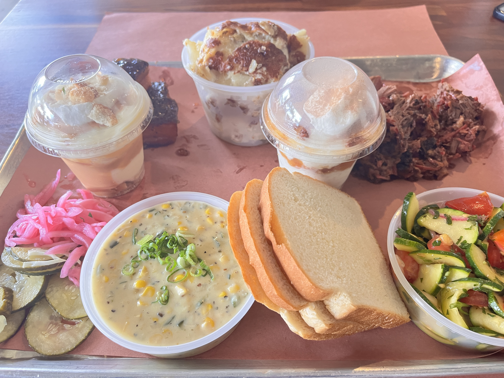
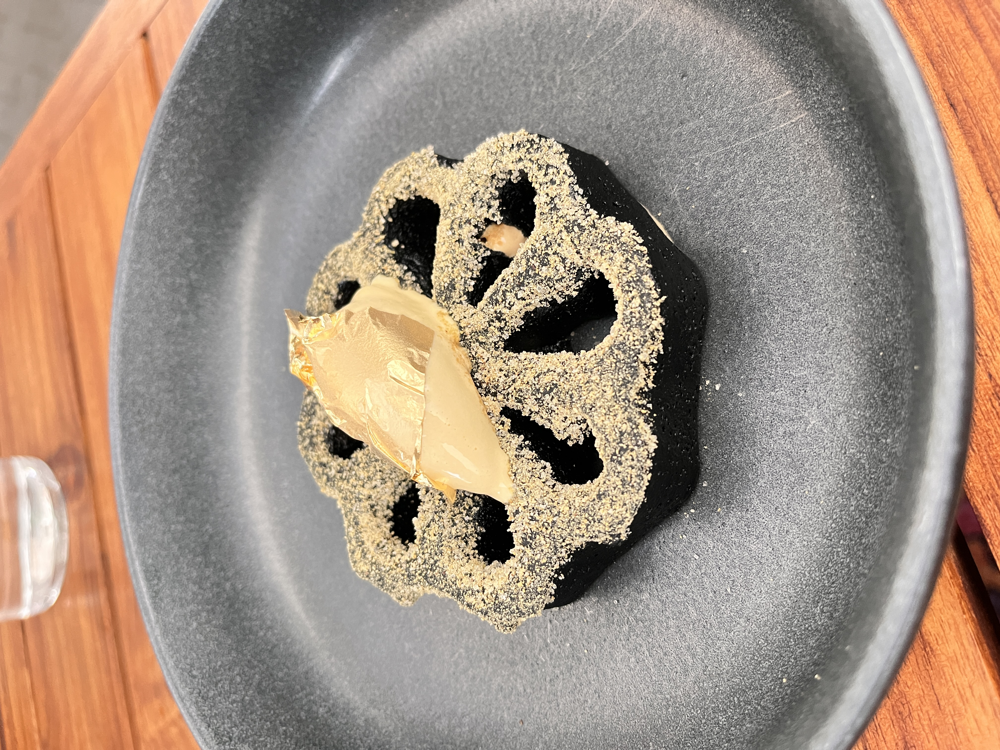
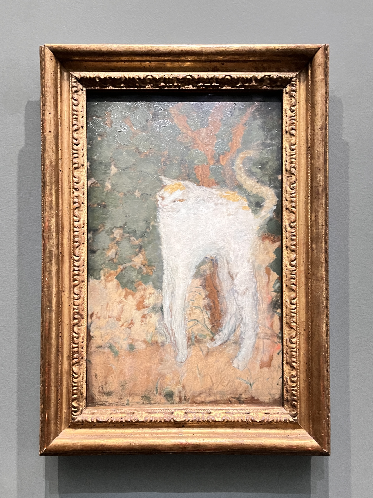

# Cathy Zhao

Hi! I'm a Computer Science student at Cornell originally from Seattle. I spent the past two summers in Austin working as a Software Development Engineer Intern at Amazon Web Services, where I built infrastructure tools for AWS Marketplace.

I love the challenge of untangling complex systems—whether that's debugging module compatibility issues in JavaScript, optimizing database queries, or analyzing text computationally. I'm seeking full-time roles where I can continue growing as an engineer and contribute to meaningful projects.

Outside of tech, I love traveling, working on jigsaw puzzles, and trying new restaurants.

  

    <!-- First set -->
    

      <svg viewBox="0 0 24 24" width="48" height="48" fill="#3178c6">
        <path d="M1.125 0C.502 0 0 .502 0 1.125v21.75C0 23.498.502 24 1.125 24h21.75c.623 0 1.125-.502 1.125-1.125V1.125C24 .502 23.498 0 22.875 0zm17.363 9.75c.612 0 1.154.037 1.627.111a6.38 6.38 0 0 1 1.306.34v2.458a3.95 3.95 0 0 0-.643-.361 5.093 5.093 0 0 0-.717-.26 5.453 5.453 0 0 0-1.426-.2c-.3 0-.573.028-.819.086a2.1 2.1 0 0 0-.623.242c-.17.104-.3.229-.393.374a.888.888 0 0 0-.14.49c0 .196.053.373.156.529.104.156.252.304.443.444s.423.276.696.41c.273.135.582.274.926.416.47.197.892.407 1.266.628.374.222.695.473.963.753.268.279.472.598.614.957.142.359.214.776.214 1.253 0 .657-.125 1.21-.373 1.656a3.033 3.033 0 0 1-1.012 1.085 4.38 4.38 0 0 1-1.487.596c-.566.12-1.163.18-1.79.18a9.916 9.916 0 0 1-1.84-.164 5.544 5.544 0 0 1-1.512-.493v-2.63a5.033 5.033 0 0 0 3.237 1.2c.333 0 .624-.03.872-.09.249-.06.456-.144.623-.25.166-.108.29-.234.373-.38a1.023 1.023 0 0 0-.074-1.089 2.12 2.12 0 0 0-.537-.5 5.597 5.597 0 0 0-.807-.444 27.72 27.72 0 0 0-1.007-.436c-.918-.383-1.602-.852-2.053-1.405-.45-.553-.676-1.222-.676-2.005 0-.614.123-1.141.369-1.582.246-.441.58-.804 1.004-1.089a4.494 4.494 0 0 1 1.47-.629 7.536 7.536 0 0 1 1.77-.201zm-15.113.188h9.563v2.166H9.506v9.646H6.789v-9.646H3.375z"/>
      </svg>
      TypeScript
    

    
  

    <svg viewBox="0 0 24 24" width="48" height="48" fill="#61dafb">
      <path d="M14.23 12.004a2.236 2.236 0 0 1-2.235 2.236 2.236 2.236 0 0 1-2.236-2.236 2.236 2.236 0 0 1 2.235-2.236 2.236 2.236 0 0 1 2.236 2.236zm2.648-10.69c-1.346 0-3.107.96-4.888 2.622-1.78-1.653-3.542-2.602-4.887-2.602-.41 0-.783.093-1.106.278-1.375.793-1.683 3.264-.973 6.365C1.98 8.917 0 10.42 0 12.004c0 1.59 1.99 3.097 5.043 4.03-.704 3.113-.39 5.588.988 6.38.32.187.69.275 1.102.275 1.345 0 3.107-.96 4.888-2.624 1.78 1.654 3.542 2.603 4.887 2.603.41 0 .783-.09 1.106-.275 1.374-.792 1.683-3.263.973-6.365C22.02 15.096 24 13.59 24 12.004c0-1.59-1.99-3.097-5.043-4.032.704-3.11.39-5.587-.988-6.38-.318-.184-.688-.277-1.092-.278zm-.005 1.09v.006c.225 0 .406.044.558.127.666.382.955 1.835.73 3.704-.054.46-.142.945-.25 1.44-.96-.236-2.006-.417-3.107-.534-.66-.905-1.345-1.727-2.035-2.447 1.592-1.48 3.087-2.292 4.105-2.295zm-9.77.02c1.012 0 2.514.808 4.11 2.28-.686.72-1.37 1.537-2.02 2.442-1.107.117-2.154.298-3.113.538-.112-.49-.195-.964-.254-1.42-.23-1.868.054-3.32.714-3.707.19-.09.4-.127.563-.132zm4.882 3.05c.455.468.91.992 1.36 1.564-.44-.02-.89-.034-1.345-.034-.46 0-.915.01-1.36.034.44-.572.895-1.096 1.345-1.565zM12 8.1c.74 0 1.477.034 2.202.093.406.582.802 1.203 1.183 1.86.372.64.71 1.29 1.018 1.946-.308.655-.646 1.31-1.013 1.95-.38.66-.773 1.288-1.18 1.87-.728.063-1.466.098-2.21.098-.74 0-1.477-.035-2.202-.093-.406-.582-.802-1.204-1.183-1.86-.372-.64-.71-1.29-1.018-1.946.303-.657.646-1.313 1.013-1.954.38-.66.773-1.286 1.18-1.868.728-.064 1.466-.098 2.21-.098zm-3.635.254c-.24.377-.48.763-.704 1.16-.225.39-.435.782-.635 1.174-.265-.656-.49-1.31-.676-1.947.64-.15 1.315-.283 2.015-.386zm7.26 0c.695.103 1.365.23 2.006.387-.18.632-.405 1.282-.66 1.933-.2-.39-.41-.783-.64-1.174-.225-.392-.465-.774-.705-1.146zm3.063.675c.484.15.944.317 1.375.498 1.732.74 2.852 1.708 2.852 2.476-.005.768-1.125 1.74-2.857 2.475-.42.18-.88.342-1.355.493-.28-.958-.646-1.956-1.1-2.98.45-1.017.81-2.01 1.085-2.964zm-13.395.004c.278.96.645 1.957 1.1 2.98-.45 1.017-.812 2.01-1.086 2.964-.484-.15-.944-.318-1.37-.5-1.732-.737-2.852-1.706-2.852-2.474 0-.768 1.12-1.742 2.852-2.476.42-.18.88-.342 1.356-.494zm11.678 4.28c.265.657.49 1.312.676 1.948-.64.157-1.316.29-2.016.39.24-.375.48-.762.705-1.158.225-.39.435-.788.636-1.18zm-9.945.02c.2.392.41.783.64 1.175.23.39.465.772.705 1.143-.695-.102-1.365-.23-2.006-.386.18-.63.406-1.282.66-1.933zM17.92 16.32c.112.493.2.968.254 1.423.23 1.868-.054 3.32-.714 3.708-.147.09-.338.128-.563.128-1.012 0-2.514-.807-4.11-2.28.686-.72 1.37-1.536 2.02-2.44 1.107-.118 2.154-.3 3.113-.54zm-11.83.01c.96.234 2.006.415 3.107.532.66.905 1.345 1.727 2.035 2.446-1.595 1.483-3.092 2.295-4.11 2.295-.22-.005-.406-.05-.553-.132-.666-.38-.955-1.834-.73-3.703.054-.46.142-.944.25-1.438zm4.56.64c.44.02.89.034 1.345.034.46 0 .915-.01 1.36-.034-.44.572-.895 1.095-1.345 1.565-.455-.47-.91-.993-1.36-1.565z"/>
    </svg>
    React
  

    
    

      <svg viewBox="0 0 24 24" width="48" height="48" fill="#3776ab">
        <path d="M14.25.18l.9.2.73.26.59.3.45.32.34.34.25.34.16.33.1.3.04.26.02.2-.01.13V8.5l-.05.63-.13.55-.21.46-.26.38-.3.31-.33.25-.35.19-.35.14-.33.1-.3.07-.26.04-.21.02H8.77l-.69.05-.59.14-.5.22-.41.27-.33.32-.27.35-.2.36-.15.37-.1.35-.07.32-.04.27-.02.21v3.06H3.17l-.21-.03-.28-.07-.32-.12-.35-.18-.36-.26-.36-.36-.35-.46-.32-.59-.28-.73-.21-.88-.14-1.05-.05-1.23.06-1.22.16-1.04.24-.87.32-.71.36-.57.4-.44.42-.33.42-.24.4-.16.36-.1.32-.05.24-.01h.16l.06.01h8.16v-.83H6.18l-.01-2.75-.02-.37.05-.34.11-.31.17-.28.25-.26.31-.23.38-.2.44-.18.51-.15.58-.12.64-.1.71-.06.77-.04.84-.02 1.27.05zm-6.3 1.98l-.23.33-.08.41.08.41.23.34.33.22.41.09.41-.09.33-.22.23-.34.08-.41-.08-.41-.23-.33-.33-.22-.41-.09-.41.09zm13.09 3.95l.28.06.32.12.35.18.36.27.36.35.35.47.32.59.28.73.21.88.14 1.04.05 1.23-.06 1.23-.16 1.04-.24.86-.32.71-.36.57-.4.45-.42.33-.42.24-.4.16-.36.09-.32.05-.24.02-.16-.01h-8.22v.82h5.84l.01 2.76.02.36-.05.34-.11.31-.17.29-.25.25-.31.24-.38.2-.44.17-.51.15-.58.13-.64.09-.71.07-.77.04-.84.01-1.27-.04-1.07-.14-.9-.2-.73-.25-.59-.3-.45-.33-.34-.34-.25-.34-.16-.33-.1-.3-.04-.25-.02-.2.01-.13v-5.34l.05-.64.13-.54.21-.46.26-.38.3-.32.33-.24.35-.2.35-.14.33-.1.3-.06.26-.04.21-.02.13-.01h5.84l.69-.05.59-.14.5-.21.41-.28.33-.32.27-.35.2-.36.15-.36.1-.35.07-.32.04-.28.02-.21V6.07h2.09l.14.01zm-6.47 14.25l-.23.33-.08.41.08.41.23.33.33.23.41.08.41-.08.33-.23.23-.33.08-.41-.08-.41-.23-.33-.33-.23-.41-.08-.41.08z"/>
      </svg>
      Python
    

    
    

      <svg viewBox="0 0 24 24" width="48" height="48" fill="#f29111">
        <path d="M1.5 0h21l-1.91 21.563L11.977 24l-8.564-2.438L1.5 0zm7.031 9.75l-.232-2.718 10.059.003.23-2.622L5.412 4.41l.698 8.01h9.126l-.326 3.426-2.91.804-2.955-.81-.188-2.11H6.248l.33 4.171L12 19.351l5.379-1.443.744-8.157H8.531z"/>
      </svg>
      HTML/CSS
    

    
    

      <svg viewBox="0 0 24 24" width="48" height="48" fill="#f7df1e">
        <path d="M0 0h24v24H0V0zm22.034 18.276c-.175-1.095-.888-2.015-3.003-2.873-.736-.345-1.554-.585-1.797-1.14-.091-.33-.105-.51-.046-.705.15-.646.915-.84 1.515-.66.39.12.75.42.976.9 1.034-.676 1.034-.676 1.755-1.125-.27-.42-.404-.601-.586-.78-.63-.705-1.469-1.065-2.834-1.034l-.705.089c-.676.165-1.32.525-1.71 1.005-1.14 1.291-.811 3.541.569 4.471 1.365 1.02 3.361 1.244 3.616 2.205.24 1.17-.87 1.545-1.966 1.41-.811-.18-1.26-.586-1.755-1.336l-1.83 1.051c.21.48.45.689.81 1.109 1.74 1.756 6.09 1.666 6.871-1.004.029-.09.24-.705.074-1.65l.046.067zm-8.983-7.245h-2.248c0 1.938-.009 3.864-.009 5.805 0 1.232.063 2.363-.138 2.711-.33.689-1.18.601-1.566.48-.396-.196-.597-.466-.83-.855-.063-.105-.11-.196-.127-.196l-1.825 1.125c.305.63.75 1.172 1.324 1.517.855.51 2.004.675 3.207.405.783-.226 1.458-.691 1.811-1.411.51-.93.402-2.07.397-3.346.012-2.054 0-4.109 0-6.179l.004-.056z"/>
      </svg>
      JavaScript
    

    
    

      <svg viewBox="0 0 24 24" width="48" height="48" fill="#f05032">
        <path d="M23.546 10.93L13.067.452c-.604-.603-1.582-.603-2.188 0L8.708 2.627l2.76 2.76c.645-.215 1.379-.07 1.889.441.516.515.658 1.258.438 1.9l2.658 2.66c.645-.223 1.387-.078 1.9.435.721.72.721 1.884 0 2.604-.719.719-1.881.719-2.6 0-.539-.541-.674-1.337-.404-1.996L12.86 8.955v6.525c.176.086.342.203.488.348.713.721.713 1.883 0 2.6-.719.721-1.889.721-2.609 0-.719-.719-.719-1.879 0-2.598.182-.18.387-.316.605-.406V8.835c-.217-.091-.424-.222-.6-.401-.545-.545-.676-1.342-.396-2.009L7.636 3.7.45 10.881c-.6.605-.6 1.584 0 2.189l10.48 10.477c.604.604 1.582.604 2.186 0l10.43-10.43c.605-.603.605-1.582 0-2.187"/>
      </svg>
      Git
    

    
    <!-- Duplicate set for seamless loop -->
    

      <svg viewBox="0 0 24 24" width="48" height="48" fill="#3178c6">
        <path d="M1.125 0C.502 0 0 .502 0 1.125v21.75C0 23.498.502 24 1.125 24h21.75c.623 0 1.125-.502 1.125-1.125V1.125C24 .502 23.498 0 22.875 0zm17.363 9.75c.612 0 1.154.037 1.627.111a6.38 6.38 0 0 1 1.306.34v2.458a3.95 3.95 0 0 0-.643-.361 5.093 5.093 0 0 0-.717-.26 5.453 5.453 0 0 0-1.426-.2c-.3 0-.573.028-.819.086a2.1 2.1 0 0 0-.623.242c-.17.104-.3.229-.393.374a.888.888 0 0 0-.14.49c0 .196.053.373.156.529.104.156.252.304.443.444s.423.276.696.41c.273.135.582.274.926.416.47.197.892.407 1.266.628.374.222.695.473.963.753.268.279.472.598.614.957.142.359.214.776.214 1.253 0 .657-.125 1.21-.373 1.656a3.033 3.033 0 0 1-1.012 1.085 4.38 4.38 0 0 1-1.487.596c-.566.12-1.163.18-1.79.18a9.916 9.916 0 0 1-1.84-.164 5.544 5.544 0 0 1-1.512-.493v-2.63a5.033 5.033 0 0 0 3.237 1.2c.333 0 .624-.03.872-.09.249-.06.456-.144.623-.25.166-.108.29-.234.373-.38a1.023 1.023 0 0 0-.074-1.089 2.12 2.12 0 0 0-.537-.5 5.597 5.597 0 0 0-.807-.444 27.72 27.72 0 0 0-1.007-.436c-.918-.383-1.602-.852-2.053-1.405-.45-.553-.676-1.222-.676-2.005 0-.614.123-1.141.369-1.582.246-.441.58-.804 1.004-1.089a4.494 4.494 0 0 1 1.47-.629 7.536 7.536 0 0 1 1.77-.201zm-15.113.188h9.563v2.166H9.506v9.646H6.789v-9.646H3.375z"/>
      </svg>
      TypeScript
    

    
    

      <svg viewBox="0 0 24 24" width="48" height="48" fill="#61dafb">
        <path d="M14.23 12.004a2.236 2.236 0 0 1-2.235 2.236 2.236 2.236 0 0 1-2.236-2.236 2.236 2.236 0 0 1 2.235-2.236 2.236 2.236 0 0 1 2.236 2.236zm2.648-10.69c-1.346 0-3.107.96-4.888 2.622-1.78-1.653-3.542-2.602-4.887-2.602-.41 0-.783.093-1.106.278-1.375.793-1.683 3.264-.973 6.365C1.98 8.917 0 10.42 0 12.004c0 1.59 1.99 3.097 5.043 4.03-.704 3.113-.39 5.588.988 6.38.32.187.69.275 1.102.275 1.345 0 3.107-.96 4.888-2.624 1.78 1.654 3.542 2.603 4.887 2.603.41 0 .783-.09 1.106-.275 1.374-.792 1.683-3.263.973-6.365C22.02 15.096 24 13.59 24 12.004c0-1.59-1.99-3.097-5.043-4.032.704-3.11.39-5.587-.988-6.38-.318-.184-.688-.277-1.092-.278zm-.005 1.09v.006c.225 0 .406.044.558.127.666.382.955 1.835.73 3.704-.054.46-.142.945-.25 1.44-.96-.236-2.006-.417-3.107-.534-.66-.905-1.345-1.727-2.035-2.447 1.592-1.48 3.087-2.292 4.105-2.295zm-9.77.02c1.012 0 2.514.808 4.11 2.28-.686.72-1.37 1.537-2.02 2.442-1.107.117-2.154.298-3.113.538-.112-.49-.195-.964-.254-1.42-.23-1.868.054-3.32.714-3.707.19-.09.4-.127.563-.132zm4.882 3.05c.455.468.91.992 1.36 1.564-.44-.02-.89-.034-1.345-.034-.46 0-.915.01-1.36.034.44-.572.895-1.096 1.345-1.565zM12 8.1c.74 0 1.477.034 2.202.093.406.582.802 1.203 1.183 1.86.372.64.71 1.29 1.018 1.946-.308.655-.646 1.31-1.013 1.95-.38.66-.773 1.288-1.18 1.87-.728.063-1.466.098-2.21.098-.74 0-1.477-.035-2.202-.093-.406-.582-.802-1.204-1.183-1.86-.372-.64-.71-1.29-1.018-1.946.303-.657.646-1.313 1.013-1.954.38-.66.773-1.286 1.18-1.868.728-.064 1.466-.098 2.21-.098zm-3.635.254c-.24.377-.48.763-.704 1.16-.225.39-.435.782-.635 1.174-.265-.656-.49-1.31-.676-1.947.64-.15 1.315-.283 2.015-.386zm7.26 0c.695.103 1.365.23 2.006.387-.18.632-.405 1.282-.66 1.933-.2-.39-.41-.783-.64-1.174-.225-.392-.465-.774-.705-1.146zm3.063.675c.484.15.944.317 1.375.498 1.732.74 2.852 1.708 2.852 2.476-.005.768-1.125 1.74-2.857 2.475-.42.18-.88.342-1.355.493-.28-.958-.646-1.956-1.1-2.98.45-1.017.81-2.01 1.085-2.964zm-13.395.004c.278.96.645 1.957 1.1 2.98-.45 1.017-.812 2.01-1.086 2.964-.484-.15-.944-.318-1.37-.5-1.732-.737-2.852-1.706-2.852-2.474 0-.768 1.12-1.742 2.852-2.476.42-.18.88-.342 1.356-.494zm11.678 4.28c.265.657.49 1.312.676 1.948-.64.157-1.316.29-2.016.39.24-.375.48-.762.705-1.158.225-.39.435-.788.636-1.18zm-9.945.02c.2.392.41.783.64 1.175.23.39.465.772.705 1.143-.695-.102-1.365-.23-2.006-.386.18-.63.406-1.282.66-1.933zM17.92 16.32c.112.493.2.968.254 1.423.23 1.868-.054 3.32-.714 3.708-.147.09-.338.128-.563.128-1.012 0-2.514-.807-4.11-2.28.686-.72 1.37-1.536 2.02-2.44 1.107-.118 2.154-.3 3.113-.54zm-11.83.01c.96.234 2.006.415 3.107.532.66.905 1.345 1.727 2.035 2.446-1.595 1.483-3.092 2.295-4.11 2.295-.22-.005-.406-.05-.553-.132-.666-.38-.955-1.834-.73-3.703.054-.46.142-.944.25-1.438zm4.56.64c.44.02.89.034 1.345.034.46 0 .915-.01 1.36-.034-.44.572-.895 1.095-1.345 1.565-.455-.47-.91-.993-1.36-1.565z"/>
      </svg>
      React
    

    
    

      <svg viewBox="0 0 24 24" width="48" height="48" fill="#3776ab">
        <path d="M14.25.18l.9.2.73.26.59.3.45.32.34.34.25.34.16.33.1.3.04.26.02.2-.01.13V8.5l-.05.63-.13.55-.21.46-.26.38-.3.31-.33.25-.35.19-.35.14-.33.1-.3.07-.26.04-.21.02H8.77l-.69.05-.59.14-.5.22-.41.27-.33.32-.27.35-.2.36-.15.37-.1.35-.07.32-.04.27-.02.21v3.06H3.17l-.21-.03-.28-.07-.32-.12-.35-.18-.36-.26-.36-.36-.35-.46-.32-.59-.28-.73-.21-.88-.14-1.05-.05-1.23.06-1.22.16-1.04.24-.87.32-.71.36-.57.4-.44.42-.33.42-.24.4-.16.36-.1.32-.05.24-.01h.16l.06.01h8.16v-.83H6.18l-.01-2.75-.02-.37.05-.34.11-.31.17-.28.25-.26.31-.23.38-.2.44-.18.51-.15.58-.12.64-.1.71-.06.77-.04.84-.02 1.27.05zm-6.3 1.98l-.23.33-.08.41.08.41.23.34.33.22.41.09.41-.09.33-.22.23-.34.08-.41-.08-.41-.23-.33-.33-.22-.41-.09-.41.09zm13.09 3.95l.28.06.32.12.35.18.36.27.36.35.35.47.32.59.28.73.21.88.14 1.04.05 1.23-.06 1.23-.16 1.04-.24.86-.32.71-.36.57-.4.45-.42.33-.42.24-.4.16-.36.09-.32.05-.24.02-.16-.01h-8.22v.82h5.84l.01 2.76.02.36-.05.34-.11.31-.17.29-.25.25-.31.24-.38.2-.44.17-.51.15-.58.13-.64.09-.71.07-.77.04-.84.01-1.27-.04-1.07-.14-.9-.2-.73-.25-.59-.3-.45-.33-.34-.34-.25-.34-.16-.33-.1-.3-.04-.25-.02-.2.01-.13v-5.34l.05-.64.13-.54.21-.46.26-.38.3-.32.33-.24.35-.2.35-.14.33-.1.3-.06.26-.04.21-.02.13-.01h5.84l.69-.05.59-.14.5-.21.41-.28.33-.32.27-.35.2-.36.15-.36.1-.35.07-.32.04-.28.02-.21V6.07h2.09l.14.01zm-6.47 14.25l-.23.33-.08.41.08.41.23.33.33.23.41.08.41-.08.33-.23.23-.33.08-.41-.08-.41-.23-.33-.33-.23-.41-.08-.41.08z"/>
      </svg>
      Python
    

    
    

      <svg viewBox="0 0 24 24" width="48" height="48" fill="#f29111">
        <path d="M1.5 0h21l-1.91 21.563L11.977 24l-8.564-2.438L1.5 0zm7.031 9.75l-.232-2.718 10.059.003.23-2.622L5.412 4.41l.698 8.01h9.126l-.326 3.426-2.91.804-2.955-.81-.188-2.11H6.248l.33 4.171L12 19.351l5.379-1.443.744-8.157H8.531z"/>
      </svg>
      HTML/CSS
    

    
    

      <svg viewBox="0 0 24 24" width="48" height="48" fill="#f7df1e">
        <path d="M0 0h24v24H0V0zm22.034 18.276c-.175-1.095-.888-2.015-3.003-2.873-.736-.345-1.554-.585-1.797-1.14-.091-.33-.105-.51-.046-.705.15-.646.915-.84 1.515-.66.39.12.75.42.976.9 1.034-.676 1.034-.676 1.755-1.125-.27-.42-.404-.601-.586-.78-.63-.705-1.469-1.065-2.834-1.034l-.705.089c-.676.165-1.32.525-1.71 1.005-1.14 1.291-.811 3.541.569 4.471 1.365 1.02 3.361 1.244 3.616 2.205.24 1.17-.87 1.545-1.966 1.41-.811-.18-1.26-.586-1.755-1.336l-1.83 1.051c.21.48.45.689.81 1.109 1.74 1.756 6.09 1.666 6.871-1.004.029-.09.24-.705.074-1.65l.046.067zm-8.983-7.245h-2.248c0 1.938-.009 3.864-.009 5.805 0 1.232.063 2.363-.138 2.711-.33.689-1.18.601-1.566.48-.396-.196-.597-.466-.83-.855-.063-.105-.11-.196-.127-.196l-1.825 1.125c.305.63.75 1.172 1.324 1.517.855.51 2.004.675 3.207.405.783-.226 1.458-.691 1.811-1.411.51-.93.402-2.07.397-3.346.012-2.054 0-4.109 0-6.179l.004-.056z"/>
      </svg>
      JavaScript
    

    
    

      <svg viewBox="0 0 24 24" width="48" height="48" fill="#f05032">
        <path d="M23.546 10.93L13.067.452c-.604-.603-1.582-.603-2.188 0L8.708 2.627l2.76 2.76c.645-.215 1.379-.07 1.889.441.516.515.658 1.258.438 1.9l2.658 2.66c.645-.223 1.387-.078 1.9.435.721.72.721 1.884 0 2.604-.719.719-1.881.719-2.6 0-.539-.541-.674-1.337-.404-1.996L12.86 8.955v6.525c.176.086.342.203.488.348.713.721.713 1.883 0 2.6-.719.721-1.889.721-2.609 0-.719-.719-.719-1.879 0-2.598.182-.18.387-.316.605-.406V8.835c-.217-.091-.424-.222-.6-.401-.545-.545-.676-1.342-.396-2.009L7.636 3.7.45 10.881c-.6.605-.6 1.584 0 2.189l10.48 10.477c.604.604 1.582.604 2.186 0l10.43-10.43c.605-.603.605-1.582 0-2.187"/>
      </svg>
      Git
    

  

---

## Resume

[Download my resume](./resume.pdf){: .resume-button }

---

## Gallery {#gallery}

<!-- SLIDESHOW -->

  <!-- 1 -->
  

    
    
Lights on Lake Union from my hometown, Seattle, Washington.

  

  <!-- 2 -->
  

    
    
Cherry blossoms at the University of Washington.

  

  <!-- 3 -->
  

    
    
First time going to Apple Fest in Ithaca.

  

  <!-- 4 -->
  

    
    
Viewing the night sky at Cornell’s Fuertes Observatory.

  

  <!-- 5 -->
  

    
    
Trying real Texas BBQ in Austin.

  

  <!-- 6 -->
  

    
    
Free lunch from leftover conference catering.

  

  <!-- 7 -->
  

    
    
Dessert from my favorite restaurant during my internship.

  

  <!-- 8 -->
  

    
    
Le Chat Blanc at the Musée d’Orsay.

  

  <!-- Buttons -->
  <a class="prev" onclick="plusSlides(-1)">&#10094;</a>
  <a class="next" onclick="plusSlides(1)">&#10095;</a>

<!-- Slide indicators -->

  
  
  
  
  
  
  
  

